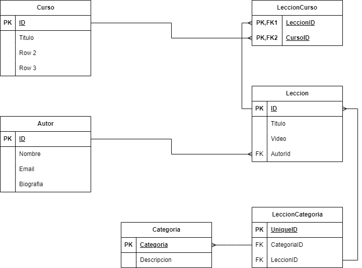

# Bootcamp Lemoncode Backend Continuo - [Relacional] Modulo - 1- Modelado
## Caso  básico

Enunciado
Una startup tecnológica va a desarrollar un portal de ELearning y nos ha pedido que realizamos el modelo de datos de dicho sistema.

A tener en cuenta:

Va a ser un portal orientado al mundo de la programación.
El portal va a estar compuesto por cursos, cada curso está compuesto a su vez por un número de videos y artículos que lo acompañen.
La página de cursos debe mostrar la lista de autores que lo hicieron.
La página de un video debe mostrar el autor que lo realizó.
Los videos y el contenido de cada artículo se almacenan en un storage S3 y en un headless CMS, en la base de datos sólo almacenaremos los Id's a esos recursos.
Los videos se pueden clasificar por temáticas (Devops / Front End / Back End / ...)
Los videos tienen autores (ponemos la restricción, un video tiene un autor), un curso puede tener varios autores.
En principio los vídeos no se van a compartir entre diferentes cursos (aunque sería una amplicacíon interesante del ejercicio.
Hay una opción para ver la página con la biografía del autor.

- Un curso puede tener N Lecciones y una Lección puede estar en varios cursos, por eso he creado una tabla intermedia llamda LeccionCurso. Tiene una clave primaria compuesta porque una misma Leccion solo puede estar en un curso. No puede haber dos lecciones iguales en un curso.
- Un Autor puede hacer N Lecciones, pero una lección solo puede tener un Autor
- He planteado que una Lección puede tener varias categorías ( por ejemplo puede estar en Backend y en DevOps) así que también debemos crear una tabla intermedia.